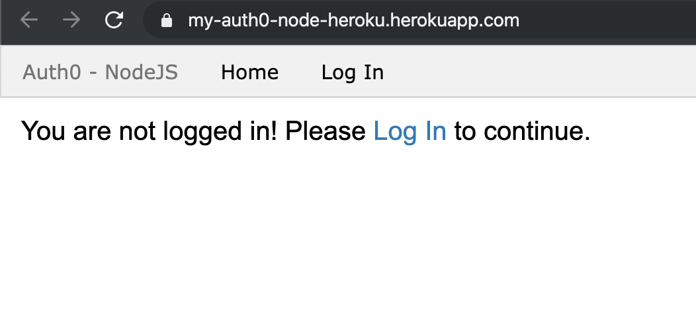
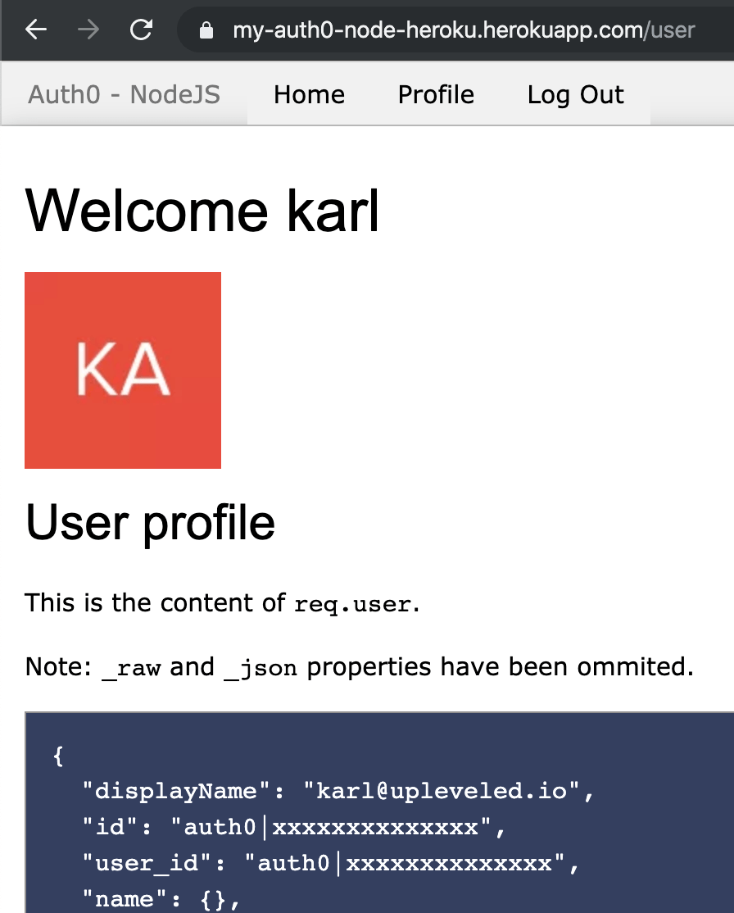

# Auth0 + Node.js on Heroku

A starter template for server-side authentication with Node.js using Auth0 (deployable to Heroku).

Based off of [the official Node.js Web App Sample](https://github.com/auth0-samples/auth0-nodejs-webapp-sample).

## Set up Auth0

Setup for Auth0 is fast and easy:

1. [Sign up for a free account at Auth0](https://auth0.com/), go to [the Dashboard](https://manage.auth0.com) and hit the **Create** button:
   
2. Create an application with the "Regular Web Application" template:
   
3. Go to the **Settings** tab and make a note of the **Domain**, **Client ID** and **Client Secret**. This information will be used for the Heroku setup.
   

## Set up Heroku

Create a Heroku account at [Heroku - Sign up](https://signup.heroku.com/), and then click on this button:

[](https://heroku.com/deploy?template=https://github.com/karlhorky/auth0-node-heroku)

This will set up a new application on your Heroku account using this repo as a template.

Choose your own app name, and use it in the `AUTH0_CALLBACK_URL` field.

During setup you'll also be asked for some other environment variables, which is the information that we noted earlier in the Auth0 setup:


After Heroku is set up, return to the Auth0 Settings page and enter the URL in the Allowed urls (replace **YOUR-APP** with the **App name** that you chose):

1. Enter your **Allowed Callback URLs**:
   ```
   http://localhost:3000/callback,https://YOUR-APP.herokuapp.com/callback
   ```
2. Enter your **Allowed Logout URLs**:
   ```
   http://localhost:3000,https://YOUR-APP.herokuapp.com
   ```

It should appear like this:


Now everything should be set up! If you go to the application, it should allow you to register and log in to view your account details:

### Homepage



### Login


### View User Details



## Run the Server Locally

If you want to run the server locally, you can do this as follows:

Install the dependencies.

```sh
npm install
```

Rename `.env.example` to `.env` and replace the values for `AUTH0_DOMAIN`, `AUTH0_CLIENT_ID`, and `AUTH0_CLIENT_SECRET` with your Auth0 information (from the Settings page). Replace `EXPRESS_SESSION_SECRET` with a secret to be used for the session.

```sh
# Copy configuration to replace with your own information
cp .env.example .env
```

Run the app.

```sh
npm start
```

The app will be served at `localhost:3000`.
